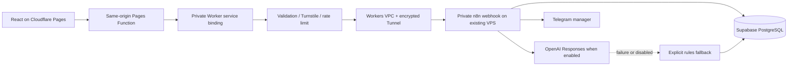

# AI Lead Automation

A connected portfolio demo built with React, TypeScript and Vite.

**Live:** https://ai-lead-automation-demo.pages.dev/

## What is implemented

- Responsive lead form with validation, loading, success/error states and a local preview option.
- Cloudflare Turnstile, same-origin backend, size limits and a per-IP request limit.
- An isolated, self-hosted n8n workflow with an authenticated private webhook.
- Server validation and atomic PostgreSQL deduplication in a dedicated Supabase Free project.
- Qualification with priority, category, score, summary and next steps.
- Telegram manager notifications, with explicit delivery status.
- OpenAI Responses adapter with structured output validation and rules fallback.

**OpenAI is currently disabled pending API credits.** Live submissions receive an assessment from server rules and are labelled accordingly. No successful OpenAI call is claimed. Email follow-up is not configured or sent. Supabase is the test lead store; HubSpot is not connected.

Use fictional details. Live submissions persist in the private test database. The manager receives a reference, assessment and summary. If OpenAI is enabled, company, budget and project message are sent to OpenAI with `store: false`; email, phone and full name are omitted from that request. Local preview sends no lead data. The page also loads Google Fonts and, in live mode, Cloudflare Turnstile.

## Architecture



The Worker accepts only `/api/leads` and `/api/config`. It forwards a fixed path to n8n; it cannot proxy arbitrary URLs or expose the editor. Its public `workers.dev` and preview URLs are disabled. The Pages Function uses a service binding. No application DNS changes are required.

n8n, its external task runner and Cloudflare Tunnel run in rootless Docker under a dedicated unprivileged account. The editor binds to server loopback and is accessed through an SSH management tunnel. Processing continues when the developer's PC is off. Existing application services are not part of this stack.

Workers VPC is a beta currently available free on all Workers plans. Recheck its availability/pricing before expanding this deployment. Sources: [Workers VPC](https://developers.cloudflare.com/workers-vpc/get-started/), [n8n external runners](https://docs.n8n.io/hosting/configuration/task-runners/).

## Run and verify locally

Node.js 22.12+ is required. Cloudflare builds use the version in `.node-version`.

```sh
npm ci
npm run dev
npm test
npm run build
npm run preview
```

Local Vite starts in **Local preview** and needs no secrets. A static preview does not start n8n or the backend. Tests cover invalid/untrusted input, deterministic scoring, provider refusals and malformed output, honest network fallback, origin/proof rejection, request size limits and removal of internal details from public responses.

`npm run build` type-checks the frontend, Worker and Pages Functions, then writes the frontend to `dist`.

## Deployment

The existing Pages Git integration deploys `main` using `npm run build` and output `dist`. `wrangler.jsonc` defines its `LEAD_API` service binding. Deploy the dedicated Worker first:

```sh
npx wrangler deploy --config worker/wrangler.jsonc
npx wrangler secret put LEAD_WEBHOOK_SECRET --config worker/wrangler.jsonc
npx wrangler secret put TURNSTILE_SECRET_KEY --config worker/wrangler.jsonc
npx wrangler secret put TURNSTILE_SITE_KEY --config worker/wrangler.jsonc
```

Use a scoped deployment token only in the terminal environment. Never put a provider key in `VITE_*`, source, a workflow export or a command argument. The Turnstile widget must allow the production Pages hostname and the server verifies action `lead`. The VPC service ID in `worker/wrangler.jsonc` identifies this account's dedicated n8n service; it is not a secret. For another account, create a corresponding service and update the ID and allowed origin/hostname.

Apply `infra/supabase/001_leads.sql` once in the dedicated Supabase SQL editor. Tables and functions deny anonymous/authenticated clients; only the server service role can access them. Use `.env.example` as a list of names, supplying actual values privately on the server and in Cloudflare Worker secrets.

`infra/n8n/compose.yaml` expects an already configured rootless Docker context, a private `.env` and a persistent `n8n_data` volume. Do not run it against an unrelated production Docker context. n8n and runner versions are pinned together. Keep the n8n encryption key and volume backed up securely.

Generate the secret-free import with:

```sh
node infra/n8n/build-workflow.mjs
```

Import `infra/n8n/workflow.json` into the separate n8n instance. Create an HTTP Header Auth credential named `Lead webhook environment secret`, header `X-Lead-Secret`, value expression `={{ $env.LEAD_WEBHOOK_SECRET }}`; select it on the webhook node and publish the workflow. Other HTTP nodes resolve provider secrets directly from the server environment. Environment access is enabled for these owner-controlled nodes; do not give untrusted users workflow-editing access.

## Failure behavior and limits

- The edge permits five requests per IP per minute per Cloudflare location. PostgreSQL separately enforces a global limit of 100 new records per UTC day.
- Canonical complete input is hashed in PostgreSQL. Identical submissions return the saved result and do not send another notification. A changed message is a new inquiry. Simultaneous submissions use an atomic reservation and 90-second lease.
- Database and OpenAI HTTP nodes have two bounded attempts and 12-second request timeouts. The workflow has a 75-second execution limit. OpenAI is disabled by default; provider/schema errors use labelled server rules.
- The record and assessment are saved before Telegram. Telegram delivery failures leave that record available. Ambiguous notification timeouts are marked `unknown` and are **not blindly resent**, because the first message might already have arrived. Pending/unknown notifications require checking the manager inbox before manual recovery.
- A browser/backend outage leaves the form intact and offers a local assessment with **delivery unconfirmed**. A retry with identical details is safe against duplicate records. Local output never asserts a database write or a successful AI call.
- n8n does not retain execution payloads. Worker application logs contain event names, request IDs, status and assessment mode, not lead text or keys. Worker observability storage is off by default; use temporary logs for diagnosis without adding payloads.
- Demo lead records persist until the owner removes them in the dedicated Supabase project. There is no automated retention job yet. Use only synthetic portfolio data and remove test records when no longer needed.

The rules use budget, English service keywords, brief detail and timing keywords. They can miss context or negation. A person should review any assessment; identity and demographics are not scored.

## Remaining setup

1. Add OpenAI API credits with the owner's approval, then set `OPENAI_ENABLED=true` on n8n and restart only this stack. The configured model is `gpt-4.1-mini`. Run one synthetic public-URL test and confirm the UI says OpenAI before advertising live AI classification.
2. Email requires a verified sender, transport credentials and an explicit test recipient. No sender account or email integration is provisioned here.
3. Before real customer use, add operational monitoring, tested backups, a retention policy and an appropriate account/access model. This is a portfolio demonstration with free-service limits, not a production SLA.

## Structure

- `src/services`: frontend adapter, local preview scoring and validation.
- `src/components`: qualification result and Turnstile integration.
- `functions/api`: same-origin Pages bridge.
- `worker`: protected private backend and VPC binding.
- `infra/n8n`: reproducible workflow, pure qualification functions and isolated runtime configuration.
- `infra/supabase`: atomic reservation, deduplication and persistence migration.
- `tests`: offline validation, failure and boundary tests.

MIT — see [LICENSE](LICENSE).
